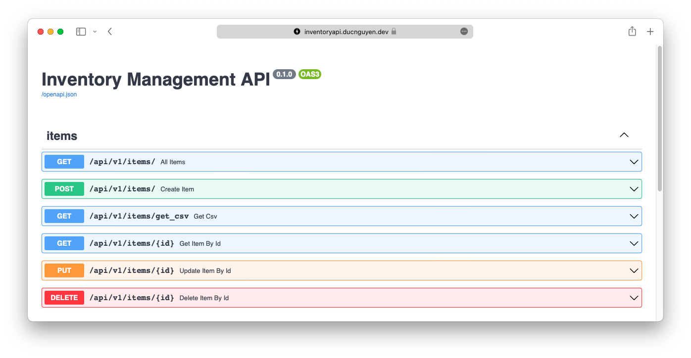

# Inventory Management
[](https://github.com/DukeNgn/inventory-tracking/actions/workflows/ci.yml)

Interactive API at: www.inventoryapi.ducnguyen.dev/docs

<p align="center">
    
</p>

## :computer: Back-end Tech Stack
+ Python 3.8
+ FastAPI
+ MongoDB
+ Docker and Compose

## :star2: Features

### For clients:
+ [CRUD](https://en.wikipedia.org/wiki/Create,_read,_update_and_delete) Functionality. Users are able to:
  + Create new item in the inventory
  + View all items in the inventory
  + View item by ID
  + Delete item by ID
  + Update item by ID
+ Export all products in the inventory to a CSV file.

### For developers:
+ [Swagger UI](https://swagger.io/tools/swagger-ui) auto generated from OpenAPI, allows visualizing and interacting with the API without a front-end.
+ Async functionalities.
+ Easy, extendable models and schemas.
+ Schemas are validated by [Pydantic](https://pydantic-docs.helpmanual.io/).
+ Wrapped `ObjectID` (`_id` field) from MongoDB by a custom field, compatible with openapi standard. More information [here](https://github.com/tiangolo/fastapi/issues/1515).
+ Environment variables are parsed by `.env`, validated by [Pydantic](https://pydantic-docs.helpmanual.io/).
+ Containerized with [Docker](https://www.docker.com/) and [Compose](https://docs.docker.com/compose/) for easy deployment.
+ [pre-commit hook](https://pre-commit.com/) for auto linting before git commit.
+ Api tests done by [Pytest](https://docs.pytest.org/) and [Tavern](https://taverntesting.github.io).
+ CI runs tests on push by GitHub Actions.

## :hammer_and_wrench: Setup
Clone the repo: `git clone https://github.com/DukeNgn/inventory-tracking.git`
### .env
+ `cp example.env .env` to create environment file.
+ Change the content of the `.env` file to the local environment. For example:
    ```
    APP_NAME="Inventory Tracking API"
    MONGO_URI=mongodb://localhost:27017
    ```
    is a valid configuration for the default MongoDB.

### Build using docker and docker-compose (recommended):

+ `docker-compose up --build -d` to start building the containers in the background.
+ Go to `localhost:8000/docs` to access the interactive Swagger UI of the API.

### Build without Docker:

+ Install [poetry](https://python-poetry.org/) - the Python dependency management.
+ `poetry shell` to create a virtual environment of the project.
+ `poetry install` to install dependencies.
+ `uvicorn app.main:app --host 0.0.0.0 --port 8000 --reload` to start the API service in development mode (hot reload).
+ Go to `localhost:8000/docs` to access the interactive Swagger UI of the API.

> While developing, run `pre-commit install` before committing any changes. [pre-commit](https://pre-commit.com/) runs a style check through all changed files before committing. The rules of `pre-commits` are in `.pre-commit-config.yml` file.

## :test_tube: Testing

### With Docker container built:
+ `chmod +x run_tests.sh && ./run_tests.sh` to run tests inside the container.
### Local environment:
+ Start the app on local port 8000 (refer to the build instruction above).
+ `chmod +x run_tests.sh && ./run_tests.sh` to run tests using script.
+ Without script, tests can be ran with command `pytest app/tests`.

## :card_index_dividers: Directory Structure
+ `app` is the main directory containing all the source code.
+ `./app/main.py`: the main start up file.
+ `./run_tests.sh`: the script file to run tests.
+ Each of the subfolder in `./app` has a `README.md` for more details.

## :whale: Deployment
The project is containerized and deployed with docker-compose on my personal [Digital Ocean](https://www.digitalocean.com/) VM.
